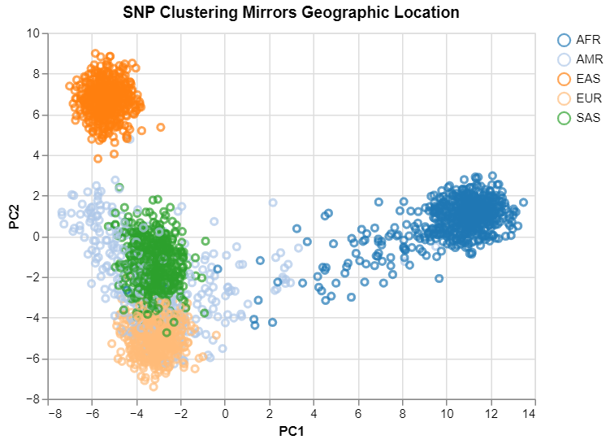

# Gene and Georgraphy Bioinformatics Project 

## Introduction
The goal of this project was to learn new skills in computational biology, practice using git to store project code and apply new data science techniques. The project was modeled after the github of MariaNattestad which was inspired by the Nature paper Genes Mirror Georgraphy within Europe by Novembre et. Al. In this paper they used Principal Component Analysis (PCA) to produce a two-dimentional visual summary of SNP variation which mirrored a geographic map of Europe.

## Methods 
### Data collection
Data was sourced from the 1000 Genome Project database. I used the most recent SNP data (2021) chomosome 22 stored in a VCF file. 

Each line of a the file contains an 

**SNP ID**: This is used to identify the different SNPs sequneced

**Sample ID**: This is a code that corresponds to the genome   

**Alleles Information**: This is where the information about what allele the sample has. Allele information is writen as two numbers because humans have two copies of thier DNA. When an sample matches the referene allele it is identified as 0. WHen the sample mathes the first allele it is identified as 1 and continues like that for the total number of alleles a SNP may have. For this project all non 0 alleles will be consider the same. 

### Extracting SNP information
To extract the SNP information the tool **pysam** was used. This is a bioinformatics tool to work with BAM & SAM formatted genetic data files. Details about this process can be found in the script vcf_to_matrix.py. The SNPs data was extracted into a numpy 2D matrix that can be used to perform the PCA on.  

### PCA 
PCA was used to reduce a matrix of SNP data into two dimentions then ploted. PCA is a method that reduces the number of variables of a data set, while perserving as much information as possible. In this case we reduce to two variables so they can be easily plotted. Tools used for this analysis were **Sklearn** and **numpy**.

### Plotting the Data 
To plot the final results of the PCA I used carried out the analysis in a Jupyter Notebook PCA_Genes_and_geography1.ipynb and used the package **altair**. This package works similarly to R's ggplot; however, to use it you need to have fewer than 5000 data points. 

## Results
The figure below shows the final result of the PCA. The first and second principal components are plotted on the x and y axis respectively. Each point represents one sample of genome and each genome is coloured based which georgaphic region the sample was collected from. Samples were colected from 5 regions Africa, America, East Asia, Europe and Southern Asia. 

Interesting findings
* African and East Asian genomes have fairly unquie clusters where American, European and South Asian genomes are clustered more closely together.
* American genomes are fairly disperced compaired to other regionalities overlapping with Eurpean and South Asian Genomes the most.

## Discussion 
The results of this project are consistant with the logic that SNPs are very similar in genomes from the same regions previously studied in Genes Mirror Georgraphy within Europe by Novembre et. Al. Additionally, it is interesting to see more variation in the American genomes suggesting that they may have more less in common with eachother than gemones from other regions.  

## Conclusion 
In conclusion this project was an effective pulled together concepts of computaitonal biology and data science and I am more confident in my ability to apply these techniques going forward. 